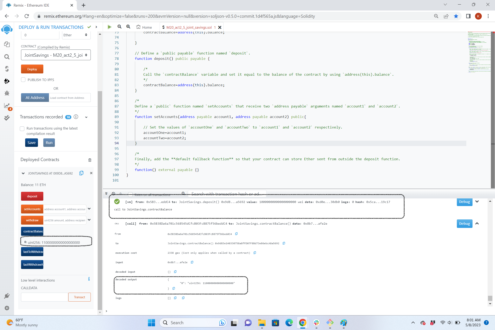

# CU-Fintech202211-Solidity_Smart_Contract

This program includes the automation of a joint savings account using Solidity Smart Contract. 

---
## Technologies

This program uses the Remix IDE to build and test smart contracts created with Solidity.

---
## Installation Guide
No installations needed for this program since the web version of the IDE is used.  to open Remix IDE website. 

---
## Usage
The program contain a Joint Savings Account Contract in Solidity. The program can be compiled and deployed using Remix VM.

The screenshots below provide the evidence of user story interactions with the program.

### Successful Compilation

### Deployed Successfully

### Set accountOne and accountTwo successfully

### Sent 1 ETH to the contract Successfully

### Sent 10 ETH to the contract Successfully

### Sent 5 ETH to the contract Successfully

### Deposited 5 ETH to accountOne Successfully

### Deposited 10 ETH to accountTwo Successfully

### LastWithdrawAccount & LastWithdrawAmount Functionality Check

---

## Contributors

Kunal Srinivasan

---

## License

2022 edX Bootcamps